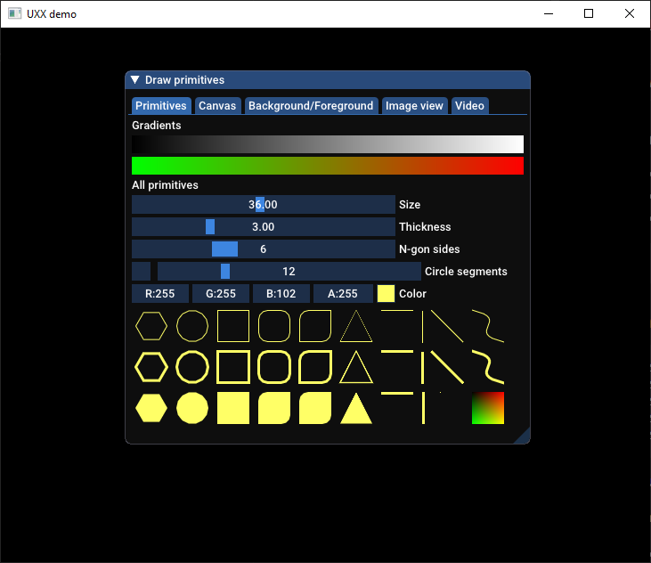

# uxx

An user friendly GUI library for C++ made for quick and easy GUI application prototyping.

## Features

- [x] Immediate mode rendering.
- [x] Window management and GUI controls (e.g. buttons, menus, tabs).
- [x] Custom graphics.
- [x] Video rendering.

## Examples

In order to create an application window, simply include `uxx.hpp` and create your application runner:

```cpp
#include <uxx/uxx.h>

int main() {
    uxx::app app;
    return app.run("My App", [](uxx::screen& screen) {
        // Now you got a screen to work with...
    });
}
```

The `app.run()` method is your application rendering loop that will be called until the user close the application.
You can use the `screen` object to render windows:

```cpp
screen.window("My window", [](uxx::pane& my_window) {
    if (my_window.button("Press me")) {
        std::puts("Hello, world!");
    }
});
```

Even rendering video is made easy:

```cpp
screen.window("Video player", [](uxx::pane& my_window) {
    static uxx::video video;

    if (not video.is_loaded()) {
        try {
            video.load_from_disk("/path/to/video.mp4");
            video.play();
        } catch (const std::exception& ex) {
            std::puts(ex.what());
        }
    }
    my_window.draw_video(video);
});
```

## Screenshot

The below screenshot is rendered by the `uxx_graphics_demo` target provided by the project (see under `examples/`).



## Build

### Requirements

| OS       | Build tool      | Compilers                              | Status                                                                                                                     |
|----------|-----------------|----------------------------------------|----------------------------------------------------------------------------------------------------------------------------|
| Linux    | `cmake >= 3.15` | `g++ >= 10.1`<br><br>`clang++ >= 10.0` | [](https://travis-ci.org/kjetand/uxx)                  |
| Windows  | `cmake >= 3.15` | `msvc >= 19.26`                        | [](https://ci.appveyor.com/project/kjetand/uxx)|

### Dependencies

- `OpenGL`
- `SFML >= 2.5.1`
- `LibVLC >= 3.0`

> **NOTE** For Windows the SFML and LibVLC libraries are automatically downloaded by `cmake`.

### Instructions

```text
$ cd uxx/
$ mkdir build
$ cd build
$ cmake ..
$ cmake --build .
```

#### Build flags
The following flags are optional with the `cmake` command.

- `-DDISABLE_EXAMPLES` - Don't build examples.
- `-DDISABLE_TESTS` - Don't build unit tests.

## Status

_Unstable_ API that will change.
In general a lot of features implemented and working, but API interface is un-finished, and features are missing.

## License

Licensed under the [MIT License](LICENSE).

Special thanks to:

- Omar Cornut and ImGui contributors (https://github.com/ocornut/imgui)
- Elias Daler (https://github.com/eliasdaler/imgui-sfml)
- Catch2 team (https://github.com/catchorg/Catch2)
